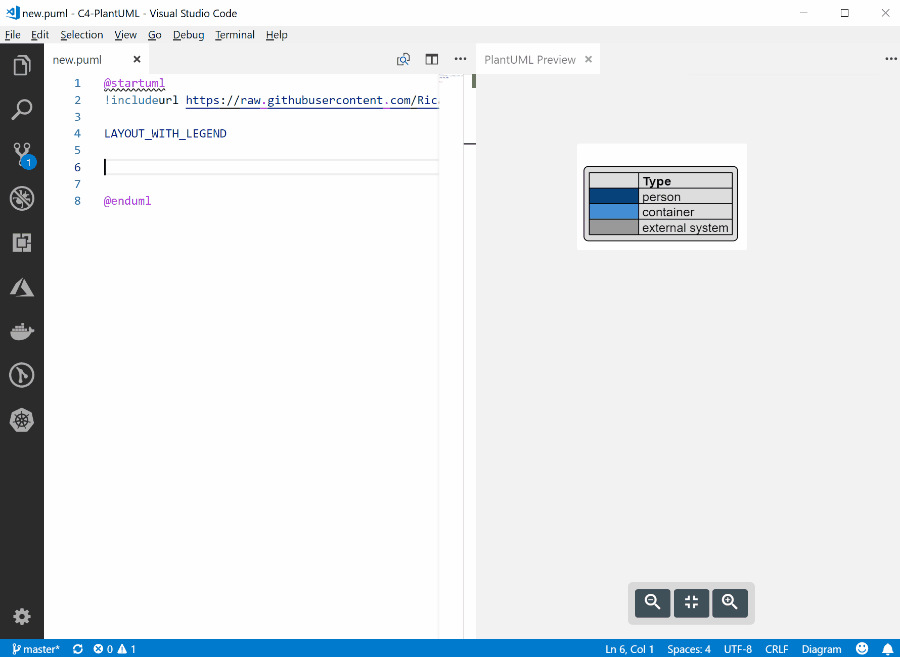

# C4-PlantUML


![Container diagram for Internet Banking System](http://www.plantuml.com/plantuml/png/pPLjZzCu4CVVzrECojlssbrWsKFTYZwmEX2zwrrw1n8WD4ccgOLZHxQpfHnyztDSDoJhLjp3eYChhTePpzy__psPFj46bIbptj7lcIXGOGufhR7aPaKVp8IpJEGa32Js7wd6ggt2uYLBpGREXyD6FCSF2z8QCuhOHuApXysaeiIWo3Z1dnsmJsGrIPfTGTTIc7t1kSle3QPooqG6Q-IQEf-RW6WmHltVH2PAoQrNc4ak5ToxS8-BL4fXjAd_-TYnHgDObY95jHkF3tHjXbF4ms23MnWFtEEYKwbIKgVYaTbnWXJrXj9Jb0KfBOLZ37cyyBLxQemmEiNaVQQgy_hSyFB1-QDfY3XyT7zwSNsAnROPAO7ytRU1khYi_aAeoqdrTmfAxxIX_AvPpiukBgVpaEN-xD7rRFXLWxuDr8_kEMrG-E9z3_vubE_4dk3E4YkEJ92wQvm7zo_dyuV_qAB_ZyR80eo4M1eZBH6hB69IT3Oi9T0rH8TJHY85nRADwNowWjPZlw_i8lZK-JJoGsRiCx0V6YxbN_KwTMYCvXhVOcEtODymBkwlEQXjhl6dtTVMbjgK9T_pTmmpd61MvrA6MNKLQwdWcQWaoLWNXRsZ328dtQcx1hfNLxDIMwD8lH5l14mWyLz1hi5i269RseCjCnj_AEGk1fWazbgCxa9ZkAEk1Tgx12Ylzonlkz3y1NC2PxvZMW8lAOP9KN2Me67IiWu68yq-qkEpy_7hvtY3FOWALIal_fYz7Gsgt7WmSAUQ4sSt5j4TI1iha3WtIHX0aRfm3HWVl5fEkj1kP0ktfVWT5aN85x7gKt-96LMS8L-KA5QO7an4Ld9Kjn2NIjwmb3GWvyTvrgLmZOoScHqOQOrsFckuOLYLC5NHGQpaLfCwmguB3BaNCcRy2FBiNWzUOOwAYPEem5dE3AMWorXRLBd-s-WwOC_t82dTi8H2Uf-lpVUZnfrXxZ-tJn3z-W8EcLj7Y8nKfA7Kf41HnhHHQFc0YRLKkMkm7cniNGfOcWqaYb8IXY7NlQhnIMlWChDVo2G_XB0rNUZtPFdiQtqybybxKlKxVQfLlkApizRkTeGkHhk1IAsNp0xC5jxJ_W8PzuF2RRVQ433XPzE29KfgkJRmz4EoiLNanrKNmfz5jnVbo0wHzbPs8x5McDEjyTIy8UJyq5M93TGdRLmKO2nBywMbUlLawe5HA3GwJ_nTdUJqoWVIWnpq--F3Im-FA-ohtpNfzhNzj5ejeo-tr6rNwmB_NMMZvHi2tSu1fwNjPvnDsvYhRjpooVrHxqJIW-VHBpyF0fR6zdUYLx-oe_uHiTy8Kmrh9NCtaxUA6T9WP7i3hp-VpewvPfNxhOxpsX49gqtzAbDfTZlDHROg00gAIir4TembMgoMJPQca7MjtLTDumAjWNVlrU95QDuJgrdc_2y0 "Container diagram for Internet Banking System")

C4-PlantUML combines the benefits of [PlantUML](http://en.plantuml.com/) and the [C4 model](https://c4model.com/) for providing a simple way of describing and communicate software architectures - especially during up-front design sessions - with an intuitive language using open source and platform independent tools.

C4-PlantUML includes macros, stereotypes, and other goodies (like VSCode Snippets) for creating C4 diagrams with PlantUML.

* [Getting Started](#getting-started)
* [Supported Diagram Types](#supported-diagram-types)
* [Snippets for Visual Studio Code](#snipptes-for-visual-studio-code)
* [Layout Options](#layout-options)
* [Samples](#advanced-samples)
* [Background](#background)
* [License](#license)

## 修改者注
这个版本是Copy自 [RicardoNiepel/C4-PlantUML](https://github.com/RicardoNiepel/C4-PlantUML)
并修改新版本 PlantUML下的Bug、示例等 


## IntelliJ IDEA 集成


* 在JetBrains 下载IntelliJ IDEA [Download IntelliJ IDEA](https://www.jetbrains.com/idea/download/)
* 安装Plugins: PlantUML Integration / PlantUML Syntax Checker


## Getting Started

At the top of your C4 PlantUML `.puml` file, you need to include the `C4_Context.puml`, `C4_Container.puml` or `C4_Component.puml` file found in the `root` of this repo.

To be independent of any internet connectifity, you can also download the files found in the `root` and reference it locally with

```c#
!include path/to/C4_Container.puml
```

Just remember to change the `!include` statements inside the top of the files.

If you want to use the always up-to-date version in this repo, use the following:

```c#
!includeurl https://raw.githubusercontent.com/gnodux/C4-PlantUML/release/1-0/C4_Container.puml
```

Now let's create a C4 Container diagram:

After you have included `C4_Container.puml` you can use the defined macro definitions for the C4 elements: `Person`, `Person_Ext`, `System`, `System_Ext`, `Container`, `Relationship`, `Boundary`, and `System_Boundary`

```csharp
@startuml C4_Elements
!includeurl https://raw.githubusercontent.com/gnodux/C4-PlantUML/master/C4_Container.puml

Person(personAlias, "Label", "Optional Description")
Container(containerAlias, "Label", "Technology", "Optional Description")
System(systemAlias, "Label", "Optional Description")

Rel(personAlias, containerAlias, "Label", "Optional Technology")
@enduml
```


In addition to this, it is also possible to define a system or component boundary.

Take a look a look at the following sample of a C4 Container Diagram:

```csharp
@startuml Basic Sample
!includeurl https://raw.githubusercontent.com/gnodux/C4-PlantUML/master/C4_Container.puml

Person(admin, "Administrator")
System_Boundary(c1, "Sample System") {
    Container(web_app, "Web Application", "C#, ASP.NET Core 2.1 MVC", "Allows users to compare multiple Twitter timelines")
}
System(twitter, "Twitter")

Rel(admin, web_app, "Uses", "HTTPS")
Rel(web_app, twitter, "Gets tweets from", "HTTPS")
@enduml
```


## Supported Diagram Types

* System Context & System Landscape diagrams
  * Import: `!includeurl https://raw.githubusercontent.com/gnodux/C4-PlantUML/master/C4_Context.puml`
  * Macros: `Person`, `Person_Ext`, `System`, `System_Ext`, `SystemDb`, `SystemDb_Ext`, `Boundary`, `System_Boundary`, `Enterprise_Boundary`
* Container diagram
  * Import: `!includeurl https://raw.githubusercontent.com/gnodux/C4-PlantUML/master/C4_Container.puml`
  * Additional Macros: `Container`, `ContainerDb`, `Container_Boundary`
* Component diagram
  * Import: `!includeurl https://raw.githubusercontent.com/gnodux/C4-PlantUML/master/C4_Component.puml`
  * Additional Macros: `Component`, `ComponentDb`

Take a look at each of the [C4 Model Diagram Samples](samples/C4CoreDiagrams.md).

## Snippets for Visual Studio Code

Because the PlantUML support inside of Visual Studio Code is excellent with the [PlantUML extension](https://marketplace.visualstudio.com/items?itemName=jebbs.plantuml), you can also find VS Code snippets for C4-PlantUML at [.vscode/C4.code-snippets](.vscode/C4.code-snippets).

Project level snippets are now supported in [VSCode 1.28](https://code.visualstudio.com/updates/v1_28#_project-level-snippets).
Just include the `C4.code-snippets` file in the `.vscode` folder of your project.

It is possible to save them directly inside VS Code: [Creating your own snippets](https://code.visualstudio.com/docs/editor/userdefinedsnippets#_creating-your-own-snippets).



## Layout Options

C4-PlantUML also comes with some layout options to make it easy and reuseable to create nice and useful diagrams:

* [LAYOUT_TOP_DOWN or LAYOUT_LEFT_RIGHT](LayoutOptions.md#layout_top_down-or-layout_left_right)
* [LAYOUT_WITH_LEGEND](LayoutOptions.md#layout_with_legend)
* [LAYOUT_AS_SKETCH](LayoutOptions.md#layout_as_sketch)

## Advanced Samples

The following advanced samples are reproductions with C4-PlantUML from official [C4 model samples](https://c4model.com/#examples) created by [Simon Brown](http://simonbrown.je/).

The core diagram samples from [c4model.com](https://c4model.com/#coreDiagrams) are available [here](samples/C4CoreDiagrams.md).

### techtribes.js

Source: [C4_Container Diagram Sample - techtribesjs.puml](samples/C4_Container%20Diagram%20Sample%20-%20techtribesjs.puml)

![techtribesjs](http://www.plantuml.com/plantuml/png/pLLjRzis4FxkNt78lco04x-uYRCYDUeNk5sn3btihX_Q8g34iyIM8ZMIgkEk_U-ZICKJBGjRaHOT3KWGUVVSSm_lpe-r8SeK6U_ezqpaH94CA6v8mSqQRysKiqHaA0p4ze6gPhLL97_5g4bXsE_NzZDo-nor9Wcks4U4mNdzK65iY4WumbyTi6jbCL6QNOvBAOnt6BeJdH8gjqmai25SO-TpdI0n92BwVY1JfUIsGfXBBXNySE6MsocHchjr_C_7qhgwYcGXA56xoUIENSYXZN6_4U20nWEttEvCAeggRNzbTXo14fqYRMEPez9IU8uDFXNmqgs0HhWx8_7xH9NvLcVzomV3yQn9iJyUpIwMRLnicQ4IXDzy6r8Nb-MlIUfoMlxQIEcTDfXzRIw3mSNbRD7aCfgFb_F-lmhqRKZzx5QxGCt6-zxwX5J-9_A4TnPRSC84ggzDvy7eSh4u_nA9lYiR8tCm4Y9fZBICM2aHawAJCegWzoGw71CK51HBKjFvz0Y2PR_NrWW-TJvTLKDcKfs07nh-oBVw_kYkC08RNs8JP-0Bnk_xQsxu1ZO-M--xbzGUMUQUVsTV0N3owD5KIB7BPA7XfKPr0iT67T50xink2cjs094a2XDYaEun0jVzyJ5VcZ71j56aLFouVs1o1CDWd1h58jHdxpIyNZantfv0y3zdWUA1Bolt211UOGJJFESiTZ7UY5xlIhEF-70mdBn-HZwGBgnonKG2p_-OTs4jCsi8uxFRjrUzqcxIwxsnNZ3bN6urb1HrML4V66uXHvbpx8Ads7MNWi9q0J_Obzru9oFxH1EVmKR934oAm6LCE9IPTO6oX1dxHGI5NzQWBNDfLGexXcZOOdH3yjobLxMLo-uQkKlBGYogxJ33vxlLxx_2-Tbv8w6LZOIwaO9xGuPPX4gdBBSxXB_NXob5X2Qb-HDcdXOHACnbbUWHzWhv3OsQTxDazktlD6IzdAv7m-DyDH8Lfy04nLlKHu9jBAXlcePQlqahXXFAenr89KKY5pCOdWrRnF9tUBrQzQRbDDaWKWq_HbmcODCt-YTtZsQBQ8un4rB_oPiglCmjHrJDoeGnpANGacDPmGUCl9U6N4cNSRUA6rw98rHL9KW117IS8YquKh2gi6Cq2y_73i-0vdhBZ3aO8rvdxsRyUUZakRJw9CoaHHIwpAoSkjKZAayxuSY2qzF9NOV0GujXDTMeGq6VhjSlLlzeUDAfpQvxW0G3x1v0bODpzkrI-LuZeRxmt5rk5IjltSWGpzPrxzbYDk-wGeJHg7_HWbxhZqQ4mD2NQyFcUCzicSAo58sC9Iz9A0F3SNymhhEe2WjENxxuJrcwtltIL8CWpMHVtUaNMeRPjcj-_znjgAfJgc1FqEox69ZOI9MvOghD4aUbjO2Q0NnRrV13t4WM1l8YuYo6M5Bqeu8PgHX-QIpVaBLG-sbJQ2QISbYwHFO3ior07RygZTFNAQCKnTlhq_fKVuo25Xd_6m00 "techtribesjs")

### Message Bus and Microservices

Source: [C4_Container Diagram Sample - message bus.puml](samples/C4_Container%20Diagram%20Sample%20-%20message%20bus.puml)

![messagebus](http://www.plantuml.com/plantuml/png/bPJVRzis4CVVzLVSl8UcG1gtnPxsLCSsbdPEx5eEWZq99-fi4Q58WZ-SkiF-zv5IfDAB1ZHvYCdptVTpFtZ-P1qQvni1av8VIfIFMh19zWkNJFYAl15GEwVjxzEfmQUh0tUrBxqbmvHq9DqLKytq85NblqtdlxtR29Jk_dOrRT0wCi5Kp8CZSadcIWTCzWQy335DY0LN4-oL4Eg9omE8u0GeApZxcXiRJWe24uHYACGfQFJvmKj0PX-vr6YmWIU3-e5NheQFxzydzWQ_tPArUA2SVwVsosmr-sjzlojswqsnM3_SPM-U3REyoFzSxkOtlSV3vzrDiLh-iRnRNBpDicn3nYfvmRnrgY5p2VFXD9b1Rvu4r_na7JN5jVAoGdEwO1-2I-yDd-LUcGOTLtBo5lxECWX_GsqNg7NgFTDQSDPv1_iNFA9bXcjt2JDvy09DDCzYR-sGX8sDR526mcDpkG5jr9uBYjcTu_gGmf8vSaOfE-zCFVSISctY0A-LSj6ugmcqujA1sWCoHjP2g6r80tXIwWjoqqscABqDMizpWcjle_GMovAxswyjng2qMXdNYWTtBYE9ZYITVQbhAFg6F9EIjhqjhMdhorFyd1j2HnPap5LmInLKwB2b3MAWlT7AqWWGVSLT0fl5UmgQ_pgzkblkud5Zr95N0QRC0IMtRM_UFGKJj3AHj4V6HJYEi1RbZu5LPJgh1JeiqRQyjK4c23vyPF6MEsN8_jnGWlvGSGIadKi9jwVywoeHnxvvtwc28naRnDj78SGmi1zDnGfgnLxJsq19EXjl4RuyaaokNIvfVO2bykxvfO2hqK6DHmh_j2P9LU3zasLR4ibMT_jt7xC9dpUxtIOFRj6fs7RBER8ozpeKzpzDXbZ_8OgXFKbs2L_ozTtqJ7WriePT7Zd9oWu5gAZoG6Mks2Ev4DrbzJ8utQrE9CdDjyacegtEY4hwrFhsTbFatO_Hudh-NCBvDe-iu4ycaSfq6_4gYLPZX3wOHalfqF-XfIzlYEXONKosmbEn7QETAGN7Jo5ltuX_0G00 "messagebus")

## Background

[PlantUML](http://en.plantuml.com/) is an open source project that allows you to create UML diagrams.
Diagrams are defined using a simple and intuitive language.
Images can be generated in PNG, in SVG or in LaTeX format.

PlantUML was created to allow the drawing of UML diagrams, using a simple and human readable text description.
Because it does not prevent you from drawing inconsistent diagrams, it is a drawing tool and not a modeling tool.
It is the most used text-based diagram drawing tool with [extensive support into wikis and forums, text editors and IDEs, use by different programming languages and documentation generators](http://en.plantuml.com/running).

The [C4 model](https://c4model.com/) for software architecture is an "abstraction-first" approach to diagramming, based upon abstractions that reflect how software architects and developers think about and build software.
The small set of abstractions and diagram types makes the C4 model easy to learn and use.
C4 stands for context, containers, components, and code — a set of hierarchical diagrams that you can use to describe your software architecture at different zoom levels, each useful for different audiences.

The C4 model was created as a way to help software development teams describe and communicate software architecture, both during up-front design sessions and when retrospectively documenting an existing codebase.

More information can be found here:

* [The C4 model for software architecture](https://c4model.com/)
* [REAL WORLD PlantUML - Sample Gallery](https://real-world-plantuml.com/)
* [Visualising and documenting software architecture cheat sheets](http://www.codingthearchitecture.com/2017/04/27/visualising_and_documenting_software_architecture_cheat_sheets.html)
* [PlantUML and Structurizr - Create models not diagrams](http://www.codingthearchitecture.com/2016/12/08/plantuml_and_structurizr.html)

## License

This project is licensed under the MIT License - see the [LICENSE](LICENSE) file for details